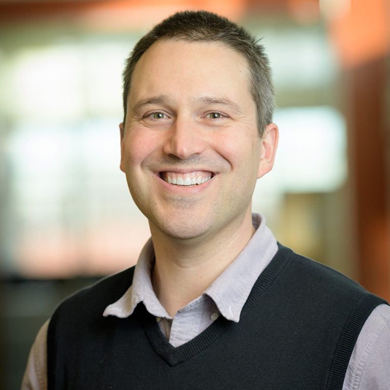
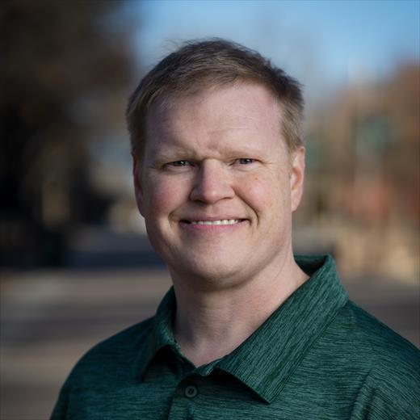
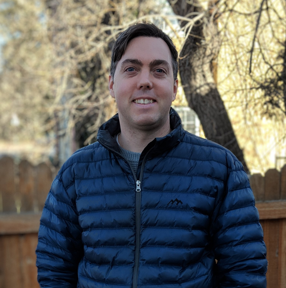
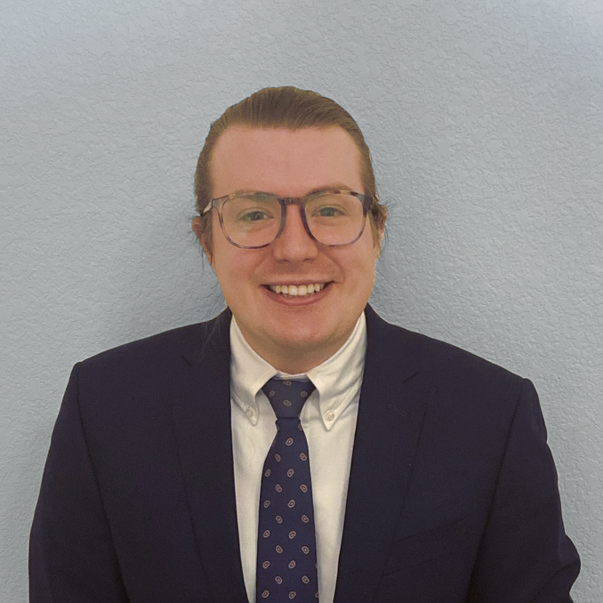

We are an interdisciplenary team of scientists with backgrounds that range from Protein engineeiring, virology, fluorescence microscopy, machine learning, and RNA biology aiming to bring efficient and reproducible automated laboratory experiments to Colorado State University, and to the broader scientific world! 

## Tag Team

<figure class="half" style="justify-content: space-around;">
         
        

            <h2> Dr. Chris Snow </h2>
            
 Bio 

            <a class="btn btn--primary .btn--large" href="https://www.engr.colostate.edu/bce/people/chris-snow/"> See more </a>
        

        
        

            <h2> Dr. Brian Geiss </h2>
            
 Bio 

            <a class="btn btn--primary .btn--large" href="https://vetmedbiosci.colostate.edu/directory/member/?id=brian-geiss-3203"> See more </a>
        

        
        

            <h2> Dr. Tim Stasevich </h2>
            
 Bio 

            <a class="btn btn--primary .btn--large" href="https://stasevichlab.colostate.edu/"> See more </a>
        

</figure>

## Cam-BIO team

<figure class="half" style="justify-content: space-around;">
         
        

            <h2> Dr. Will Raymond </h2>
            
 Bio 

            <a class="btn btn--primary .btn--large" href="https://will-raymond.github.io/will_raymond_cv/"> See more </a>
        

</figure>

<a href="mailto:wsraymon@rams.colostate.edu">

## Contact us!

If you would like to contact us about using Cam-BIO for your experimental protocol setup please leave an email in the comment box below.

Email us at cambio@colostate.edu - NOT SET UP YET



