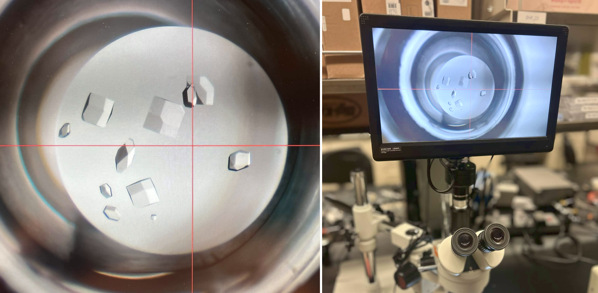

We have a growing library of experimental protocols we are automating at Colorado State University, below is a couple of examples of what we can do so far.

## Automated Protein Crystallization

{: .full}

The growth of crystals is a valuable experiment for structure exploration and only occurs under very specific conditions that can be difficult to acheive, even in a lab setting. Because of this, crystals are grown in plates where concentrations can be iterated across a gradient in order to boost the chances of encompassing the ideal concentrations with more certainty. Setting up crystal plates is arduous and requires a lot of pipetting of micro volumes. Using the OpenTrons robot allows researchers to reduce time spent on rote procedures, and work instead on experimental design.

## Cell-free Translation

{: .full}

## Duckweed Growth

{: .full}

## Protein Purification

{: .full}
